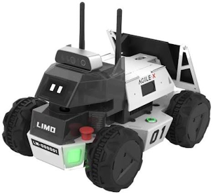
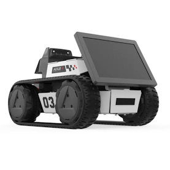

## LIMO 로봇을 이용한  ROS 실습

#### [ROS 설치 및 설정](doc_md/install_ROS_Noetic.md) 

#### [간단한 토픽 발행 및 구독](doc_md/rospy_1_WritingSimplePubSub.md) 

#### [Turtlesim 제어](doc_md/rospy_2_Turtlesim.md) 

#### [Limo로봇 시작하기](doc_md/how2start_limo.md) 

#### [Limo로봇 키보드 원격제어 노드 작성](doc_md/teleop_key4limo.md) 

#### [Limo로봇 카메라 영상 수신](doc_md/how2recieve_limo_camera_image.md) 

#### [Limo로봇 Gazebo 시뮬레이션](doc_md/limo_gazebo_simulation.md) 

#### [터틀봇3 시뮬레이션을 이용한 SLAM & Navigation 실습](doc_md/turtlebot3_simulation.md)

