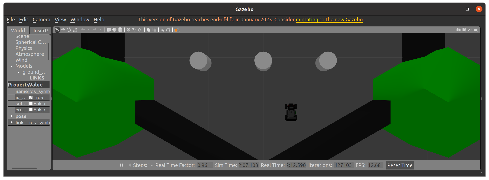
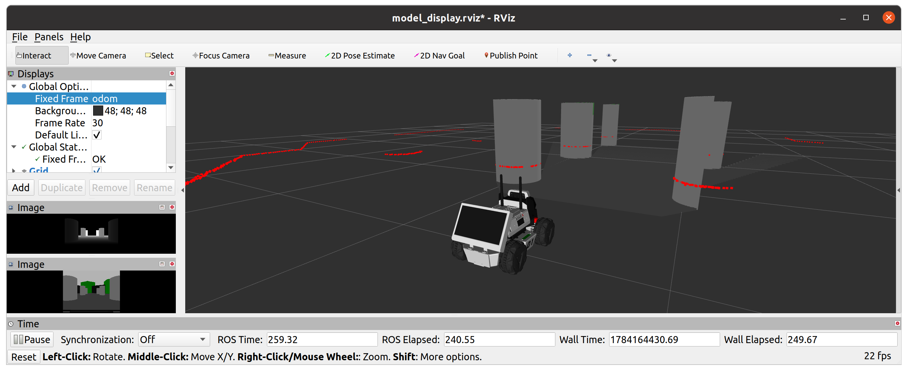

## How to Start Limo 로봇


---

## ROS 환경에서 Limo로봇 운영

**출처 :**  <http://wiki.ros.org/rospy_tutorials/Tutorials/WritingPublisherSubscriber>

**튜토리얼 레벨 :**  초급

**선수 학습 :**  ROS 튜토리얼

**빌드 환경 :**  catkin **/** Ubuntu 20.04 **/** Noetic

---

#### 0. 준비작업

- 이 후 Limo로봇의 방향기준은 카메라 방향을 전방, 모니터 방향을 후방으로 정한다.

- Limo로봇 충전 어댑터 연결(LIMO로봇의 모니터 아래 후방 덮개를 열어 전원 어댑터를 연결한다.)
- Limo로봇을 위한 키보드 및 마우스 연결(LIMO로봇의 우측면 덮개를 열어 키보드와 마우스를 연결한다.)

- **PC와 Limo로봇의 네트워크 연결 수단** 휴대폰 핫스팟 연결을 준비해 둔다.


#### 1. 전원켜기

좌측 바퀴 사이의 둥근 버튼이 전원 버튼이다. 이 버튼을 3~4초가량 충분히 길게 누르면 '삑'소리와 함께 모니터에 부팅 메세지가 출력되면서 Limo로봇의 젯슨나노 보드가 부팅된다. 부팅이 완료되면 로그인 화면에서 password 입력란에 `wego`를 입력한다.


#### 2. 네트워크 연결

##### 2.1 Limo 로봇

준비된 휴대폰 핫스팟에 연결 후 터미널을 열어 `openssh-server` 설치

```bash
sudo apt install openssh-server
```


##### 2.2 PC

준비된 휴대폰 핫스팟에 연결 후 터미널을 열어 `nmap` 설치

```bash
sudo apt install nmap
```

`ifconfig`명령으로 할당된 IP주소 확인

```bash
ifconfig
lo: flags=73<UP,LOOPBACK,RUNNING>  mtu 65536
        inet 127.0.0.1  netmask 255.0.0.0
        inet6 ::1  prefixlen 128  scopeid 0x10<host>
        loop  txqueuelen 1000  (Local Loopback)
        RX packets 2704  bytes 319199 (319.1 KB)
        RX errors 0  dropped 0  overruns 0  frame 0
        TX packets 2704  bytes 319199 (319.1 KB)
        TX errors 0  dropped 0 overruns 0  carrier 0  collisions 0

virbr0: flags=4099<UP,BROADCAST,MULTICAST>  mtu 1500
        inet 192.168.122.1  netmask 255.255.255.0  broadcast 192.168.122.255
        ether 52:54:00:b4:0d:b5  txqueuelen 1000  (Ethernet)
        RX packets 0  bytes 0 (0.0 B)
        RX errors 0  dropped 0  overruns 0  frame 0
        TX packets 0  bytes 0 (0.0 B)
        TX errors 0  dropped 0 overruns 0  carrier 0  collisions 0

wlo1: flags=4163<UP,BROADCAST,RUNNING,MULTICAST>  mtu 1500
        inet 10.42.0.2  netmask 255.255.255.0  broadcast 10.42.0.255 #<<==================== 10.42.0.2
        inet6 fe80::4889:3a82:ec42:53b9  prefixlen 64  scopeid 0x20<link>
        ether c8:09:a8:89:c3:4e  txqueuelen 1000  (Ethernet)
        RX packets 83076  bytes 82626897 (82.6 MB)
        RX errors 0  dropped 0  overruns 0  frame 0
        TX packets 50036  bytes 42741093 (42.7 MB)
        TX errors 0  dropped 0 overruns 0  carrier 0  collisions 0

wlxb0386cf34c0b: flags=4163<UP,BROADCAST,RUNNING,MULTICAST>  mtu 1500
        inet 192.168.1.137  netmask 255.255.255.0  broadcast 192.168.1.255
        inet6 fe80::f6a1:349f:54cf:2a66  prefixlen 64  scopeid 0x20<link>
        ether b0:38:6c:f3:4c:0b  txqueuelen 1000  (Ethernet)
        RX packets 0  bytes 0 (0.0 B)
        RX errors 0  dropped 0  overruns 0  frame 0
        TX packets 0  bytes 0 (0.0 B)
        TX errors 0  dropped 0 overruns 0  carrier 0  collisions 0
```

현재 할당받은 IP주소가 `10.42.0.2`인 것을 확인했다. 이제 `nmap`을 실행하여 현재 네트워크에 `10.42.0.`으로 시작하는 주소가 할당된 단말을 찾아보자.

```bash
nmap -sn 10.42.0.0/24
Starting Nmap 7.80 ( https://nmap.org ) at 2026-07-15 12:04 KST
Nmap scan report for S10e_Hotspot (10.42.0.1))# <<====================== 휴대폰 핫스팟
Host is up (0.084s latency).
Nmap scan report for a10sc (10.42.0.2)# <<============================== PC 노트북
Host is up (0.00038s latency).
Nmap done: 256 IP addresses (2 hosts up) scanned in 3.17 seconds # <==== 총 2개의 단말 발견
```

위 결과로 휴대폰 핫스팟 연결 시 휴대전화, 노트북 PC에 할당된 주소를 알아낼 수 있었다. 이제 Limo로봇을 휴대폰 핫스팟에 연결 후 `nmap`을 실행해보자.

```bash
nmap -sn 10.42.0.0/24
Starting Nmap 7.80 ( https://nmap.org ) at 2026-07-15 12:04 KST
Nmap scan report for S10e_Hotspot (10.42.0.1))# <<====================== 휴대폰 핫스팟
Host is up (0.084s latency).
Nmap scan report for a10sc (10.42.0.2)# <<============================== PC 노트북
Host is up (0.00038s latency).
Nmap scan report for a10sc (10.42.0.3)# <<============================== 새로발견된 단말(Limo 로봇)
Nmap done: 256 IP addresses (3 hosts up) scanned in 3.18 seconds # <==== 총 3개의 단말 발견
```

Limo 로봇에 `openssh-server`가 설치되었고, IP주소가 `10.42.0.3`인 것을 알아냈으므로 이제 Limo로봇을 제어할 준비가 완료되었다.

터미널에서 다음 명령으로 Limo로봇에 `ssh`원격 접속한다.

```
ssh wego@10.42.0.3
```

```
ssh wego@10.42.0.3
wego@10.42.0.176's password:
```

이 때 패스워드는 `wego`를 입력한다.

```
ssh wego@10.42.0.3
wego@10.42.0.176's password: 
Welcome to Ubuntu 18.04.6 LTS (GNU/Linux 4.9.253-tegra aarch64)

 * Documentation:  https://help.ubuntu.com
 * Management:     https://landscape.canonical.com
 * Support:        https://ubuntu.com/advantage
This system has been minimized by removing packages and content that are
not required on a system that users do not log into.

To restore this content, you can run the 'unminimize' command.

554 updates can be applied immediately.
306 of these updates are standard security updates.
To see these additional updates run: apt list --upgradable

*** System restart required ***
Last login: Wed Jul 15 09:31:50 2026 from 10.42.0.2
wego@wego-robotics:~$_
```


`ssh`원격 접속화면에서 `~/.bashrc`파일을 편집한다.

```
nano ~/.bashrc
```

```
export ROS_MASTER_URI=http:[노트북PC의 IP주소]:11311
export ROS_HOSTNAME=[Limo로봇의 IP주소]
```

이 경우 [노트북PC의 IP주소]`10.42.0.2`, [Limo로봇의 IP주소]`10.42.0.3`

편집이 완료되면 `Ctrl-X`, `y`, `Enter`순으로 입력하여 편집내용을 저장 후 종료한다. 

`ssh`원격 접속화면에서 Limo 로봇 구동 `launch`파일을 실행한다.

```
 roslaunch limo_bringup limo_start.launch
```

```bash
roslaunch limo_bringup limo_start.launch 
... logging to /home/wego/.ros/log/bf20c304-800d-11f1-93b4-23a5b90f8599/roslaunch-wego-robotics-2955.log
Checking log directory for disk usage. This may take a while.
Press Ctrl-C to interrupt
Done checking log file disk usage. Usage is <1GB.

started roslaunch server http://10.42.0.176:45715/

SUMMARY
========

PARAMETERS
 * /limo_base_node/base_frame: base_link
 * /limo_base_node/odom_frame: odom
 * /limo_base_node/port_name: ttyTHS1
 * /limo_base_node/pub_odom_tf: 
 * /limo_base_node/use_mcnamu: False
 * /rosdistro: melodic
 * /rosversion: 1.14.12
 * /ydlidar_node/angle_max: 90.0
 * /ydlidar_node/angle_min: -90.0
 * /ydlidar_node/auto_reconnect: True
 * /ydlidar_node/baudrate: 115200
 * /ydlidar_node/frame_id: laser_link
 * /ydlidar_node/frequency: 8.0
 * /ydlidar_node/ignore_array: 
 * /ydlidar_node/isSingleChannel: True
 * /ydlidar_node/port: /dev/ydlidar
 * /ydlidar_node/range_max: 12.0
 * /ydlidar_node/range_min: 0.1
 * /ydlidar_node/resolution_fixed: True
 * /ydlidar_node/reversion: True
 * /ydlidar_node/samp_rate: 3

NODES
  /
    base_link_to_camera_link (tf/static_transform_publisher)
    base_link_to_imu_link (tf/static_transform_publisher)
    base_link_to_laser_link (tf/static_transform_publisher)
    limo_base_node (limo_base/limo_base_node)
    ydlidar_node (ydlidar_ros/ydlidar_node)

ROS_MASTER_URI=http://10.42.0.1:11311

process[limo_base_node-1]: started with pid [2966]
process[ydlidar_node-2]: started with pid [2967]
process[base_link_to_camera_link-3]: started with pid [2968]
__   ______  _     ___ ____    _    ____  
\ \ / /  _ \| |   |_ _|  _ \  / \  |  _ \ 
 \ V /| | | | |    | || | | |/ _ \ | |_) | 
  | | | |_| | |___ | || |_| / ___ \|  _ <  
  |_| |____/|_____|___|____/_/   \_\_| \_\ 

process[base_link_to_imu_link-4]: started with pid [2969]
process[base_link_to_laser_link-5]: started with pid [2973]
[ INFO] [1784093297.799046102]: open the serial port: /dev/ttyTHS1
[ INFO] [1784093297.844127204]: [YDLIDAR INFO] Now YDLIDAR ROS SDK VERSION:1.4.6 .......
YDLidar SDK initializing
YDLidar SDK has been initialized
[YDLIDAR]:SDK Version: 1.4.7
LiDAR successfully connected
[YDLIDAR]:Lidar running correctly ! The health status: good
LiDAR init success!
[YDLIDAR]:Fixed Size: 420
[YDLIDAR]:Sample Rate: 4K
[YDLIDAR INFO] Current Sampling Rate : 4K
[YDLIDAR INFO] Now YDLIDAR is scanning ......
```


`rostopic pub `명령으로 로봇을 움직여보자.

```bash
rostopic pub -r 10 /cmd_vel geometry_msgs/Twist \
'{linear: {x: 0.0, y: 0.0, z: 0.0}, angular: {x: 0.0, y: 0.0, z: 0.125}}'
```

시뮬레이션 화면상의 Limo로봇이 제자리에서 왼쪽으로 천천히 회전한다.

로봇을 정지 시키려면 다음 명령을 실행한다.

```bash
rostopic pub -1 /cmd_vel geometry_msgs/Twist \
'{linear: {x: 0.0, y: 0.0, z: 0.0}, angular: {x: 0.0, y: 0.0, z: 0.0}}'
```


#### 3. `limo_pkg`를 만들고 Limo로봇을 키보드로 원격제어하는 `remote_turtle.py`노드를 만들어보자. 

**3.1 limo_pkg 생성**

작업경로를 `~/catkin_ws/src`로 변경

```bash
cd ~/catkin_ws/src
```

`rospy`에 대해 의존성을 갖는 ROS 패키지 `limo_pkg`생성

```bash
catkin_create_pkg limo_pkg rospy
```

이 전에 만들어 둔 `turtle_pkg`에서 `remote_turtle.py`와 `getchar.py`파일을 `~/catkin_ws/src/limo_pkg/src`로 복사한다.

```bash
cp ~/catkin_ws/src/turtle_pkg/src/getchar.py ~/catkin_ws/src/limo_pkg/src/
```

```bash
cp ~/catkin_ws/src/turtle_pkg/src/remote_turtle.py ~/catkin_ws/src/limo_pkg/src
```

복사한 `remote_turtle.py`를 `remote_limo.py`로 파일명 변경.

```bash
mv ~/catkin_ws/src/limo_pkg/src/remote_turtle.py  ~/catkin_ws/src/limo_pkg/src/remote_tlimo.py
```

`~/catkin_ws/src/limo_pkg/src`의 내용확인

```bash
~/catkin_ws/src/limo_pkg/src
```

```bash
ls -al ~/catkin_ws/src/limo_pkg/src
total 20
drwxrwxr-x 3 gnd0 gnd0 4096  7월 15 14:53 .
drwxrwxr-x 3 gnd0 gnd0 4096  7월 15 14:29 ..
-rw-rw-r-- 1 gnd0 gnd0 1118  7월 15 14:33 getchar.py
drwxrwxr-x 2 gnd0 gnd0 4096  7월 15 14:53 __pycache__
-rwxrwxr-x 1 gnd0 gnd0 2466  7월 15 14:51 remote_limo.py
```


` remote_limo.py` 편집

```bash
gedit ~/catkin_ws/src/limo_pkg/src/remote_tlimo.py
```

```python
#!/usr/bin/env python3

import rospy, os
from getchar import Getchar
from geometry_msgs.msg import Twist

MAX_LIN_SPD = 0.55
MIN_LIN_SPD = -0.55
MAX_ANG_SPD = 1.0
MIN_ANG_SPD = -1.0

LIN_SPD_STEP = 0.025
ANG_SPD_STEP = 0.020

msg = """
==========================
 LIMO Keyboard Teleop
==========================

w : linear.x +0.025
s : linear.x -0.025

a : angular.z +0.020
d : angular.z -0.020

SPACE : Stop

CTRL+C : Quit
==========================
"""

class RemoteLIMO():

    def __init__(self):
        rospy.init_node("remote_limo")
        


def main():
    try:
        node = RemoteLIMO()

        pub = rospy.Publisher("/cmd_vel", Twist, queue_size=10)
        tw = Twist()
        kb = Getchar()
        rate = rospy.Rate(20)

        print(msg)

        while not rospy.is_shutdown():
            if kb.chk_stdin():
                ch = kb.getch()

                if ch == 'w':
                    if tw.linear.x + LIN_SPD_STEP <= MAX_LIN_SPD:
                        tw.linear.x = tw.linear.x + LIN_SPD_STEP
                    else:
                        tw.linear.x = MAX_LIN_SPD

                elif ch == 's':
                    if tw.linear.x - LIN_SPD_STEP >= MIN_LIN_SPD:
                        tw.linear.x = tw.linear.x - LIN_SPD_STEP
                    else:
                        tw.linear.x = MIN_LIN_SPD

                elif ch == 'a':
                    if tw.angular.z + ANG_SPD_STEP <= MAX_ANG_SPD:
                        tw.angular.z = tw.angular.z + ANG_SPD_STEP
                    else:
                        tw.angular.z = MAX_ANG_SPD

                elif ch == 'd':
                    if tw.angular.z - ANG_SPD_STEP >= MIN_ANG_SPD:
                        tw.angular.z = tw.angular.z - ANG_SPD_STEP
                    else:
                        tw.angular.z = MIN_ANG_SPD

                elif ch == ' ':
                    tw.linear.x = tw.angular.z = 0.0

                elif ch == 'q':
                    break

                print("linear.x = %.3f, angular.z = %.3f" % (tw.linear.x, tw.angular.z))

            pub.publish(tw)
            rate.sleep()
        tw.linear.x = tw.angular.z = 0.0;   pub.publish(tw)
    except (KeyboardInterrupt, rospy.ROSInterruptException):
        print("Program terminated!")
    finally:
        os.system("rostopic pub -1 /cmd_vel geometry_msgs/Twist '{linear: {x: 0.0, y: 0.0, z: 0.0}, angular: {x: 0.0, y: 0.0, z: 0.0}}'")

if __name__ == "__main__":
    main()
```


#### PC에 limo ROS 패키지 설치

`~/catkin_ws/src`로 작업경로 변경

```bash
cd ~/catkin_ws/src
```

 **limo ROS 패키지 소스코드 복제**

```bash
git clone https://github.com/agilexrobotics/limo_ros.git
```

 **limo ROS 패키지 빌드**

```bash
cd ~/catkin_ws && catkin_make
```

**새로 빌드된 패키지 정보 반영**

```
source ~/catkin_ws/devel/setup.bash
```

**구동할 수 있는 `launch`파일 찾아보기**

```
ls -l ~/catkin_ws/src/limo_ros/limo_bringup/launch
total 28
-rw-rw-r-- 1 gnd0 gnd0  848  7월 16 09:29 limo_amcl.launch
-rw-rw-r-- 1 gnd0 gnd0  608  7월 16 09:29 limo_cartographer.launch
-rw-rw-r-- 1 gnd0 gnd0 1755  7월 16 09:29 limo_gmapping.launch
-rw-rw-r-- 1 gnd0 gnd0 2024  7월 16 09:29 limo_navigation_ackerman.launch
-rw-rw-r-- 1 gnd0 gnd0 1927  7월 16 09:29 limo_navigation_diff.launch
-rw-rw-r-- 1 gnd0 gnd0  779  7월 16 09:29 limo_start.launch
-rw-rw-r-- 1 gnd0 gnd0  271  7월 16 09:29 limo_teletop_keyboard.launch
```

**`limo_teletop_keyboard.launch`실행**

`roscore`가 구동된 상태에서 다음 명령 실행

```
roslaunch limo_bringup limo_teletop_keyboard.launch
```

패키지 빌드가 제대로 되었는가를 확인할 목적이므로 로봇에서 `limo_start.launch`는 실행하지 않았음.

다른 런치 파일들(`limo_gmapping.launch`, `limo_navigation_diff.launch` 등)도 동일하게 구동할 수 있다.


#### PC에 limo Gazebo 시뮬레이션 패키지 설치

`~/catkin_ws/src`로 작업경로 변경

```bash
cd ~/catkin_ws/src
```

 **limo_gazebo_sim 패키지 소스코드 복제**

```bash
git clone https://github.com/greattoe/limo_gazebo_sim.git
```

**패키지 빌드**

```bash
cd ~/catkin_ws && catkin_make
```

새로 빌드된 패키지 정보 반영

```
source ~/catkin_ws/devel/setup.bash
```

구동할 수 있는 `launch`파일 찾아보기

```
l ~/catkin_ws/src/limo_gazebo_sim/launch/
total 16
-rwxrwxrwx 1 gnd0 gnd0 1848  7월  3 03:56 limo_ackerman.launch
-rwxrwxrwx 1 gnd0 gnd0 1751  7월  3 03:56 limo_four_diff_empty_world.launch
-rwxrwxrwx 1 gnd0 gnd0 1792  7월 16 06:16 limo_four_diff_turtlebot3world.launch
-rwxrwxrwx 1 gnd0 gnd0 3873  7월 11 23:16 limo_gmapping.launch
```

` limo_four_diff_turtlebot3world.launch`구동

```
roslaunch limo_gazebo_sim limo_four_diff_turtlebot3world.launch
```






```
rostopic list
```

```
rostopic list
/camera_ir/parameter_descriptions
/camera_ir/parameter_updates
/clicked_point
/clock
/cmd_vel
/gazebo/link_states
/gazebo/model_states
/gazebo/parameter_descriptions
/gazebo/parameter_updates
/gazebo/performance_metrics
/gazebo/set_link_state
/gazebo/set_model_state
/gazebo_ros_control/pid_gains/front_left_wheel/parameter_descriptions
/gazebo_ros_control/pid_gains/front_left_wheel/parameter_updates
/gazebo_ros_control/pid_gains/front_right_wheel/parameter_descriptions
/gazebo_ros_control/pid_gains/front_right_wheel/parameter_updates
/gazebo_ros_control/pid_gains/rear_left_wheel/parameter_descriptions
/gazebo_ros_control/pid_gains/rear_left_wheel/parameter_updates
/gazebo_ros_control/pid_gains/rear_right_wheel/parameter_descriptions
/gazebo_ros_control/pid_gains/rear_right_wheel/parameter_updates
/initialpose
/joint_states
/limo/color/camera_info
/limo/color/image_raw
/limo/color/image_raw/compressed
/limo/color/image_raw/compressed/parameter_descriptions
/limo/color/image_raw/compressed/parameter_updates
/limo/color/image_raw/compressedDepth
/limo/color/image_raw/compressedDepth/parameter_descriptions
/limo/color/image_raw/compressedDepth/parameter_updates
/limo/color/image_raw/mouse_click
/limo/color/image_raw/theora
/limo/color/image_raw/theora/parameter_descriptions
/limo/color/image_raw/theora/parameter_updates
/limo/depth/camera_info
/limo/depth/image_raw
/limo/depth/image_raw/mouse_click
/limo/depth/points
/limo/imu
/limo/scan
/move_base_simple/goal
/odom
/rosout
/rosout_agg
/tf
/tf_static
```

Gazebo 시뮬레이션을 사용할 경우 `roscore` , `limo_bringup`패키지의 `limo_start.launch`를 구동하지 않아도 된다. 위 `rostopic list`명령 실행 결과를 보면, 이미 필요한 토픽들이 모두 시뮬레이션 된 것을 볼 수 있다.

이제 앞서 작업한 `limo_pkg`의 `remote_limo.py`노드를 구동하여 시뮬레이션 된 limo로봇을 제어해보자.

```
rosrun limo_pkg remote_limo.py
```

```
rosrun limo_pkg remote_limo.py 

==========================
 LIMO Keyboard Teleop
==========================

w : linear.x +0.025
s : linear.x -0.025

a : angular.z +0.020
d : angular.z -0.020

SPACE : Stop

CTRL+C : Quit
==========================

linear.x = 0.025, angular.z = 0.000
linear.x = 0.050, angular.z = 0.000
linear.x = 0.075, angular.z = 0.000
linear.x = 0.000, angular.z = 0.000
linear.x = 0.000, angular.z = 0.020
linear.x = 0.000, angular.z = 0.040
linear.x = 0.000, angular.z = 0.020
linear.x = 0.000, angular.z = 0.000
```


[튜토리얼 목록](../README.md) 


