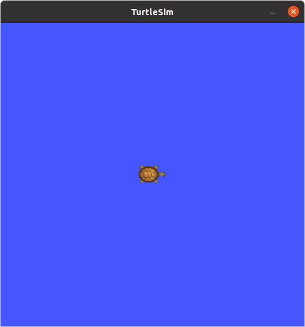
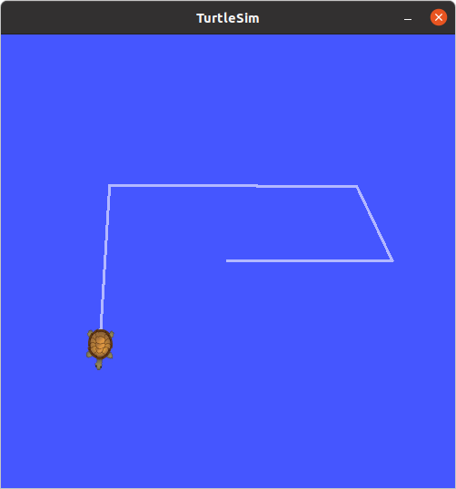

## noetic / Installation & configure

---

## ROS 설치 및 환경설정

**튜토리얼 레벨 :**  Beginner(초급)

**이 튜토리얼 작성 환경 :**  catkin **/** Ubuntu 20.04 **/** Noetic

**참조 :**

- <http://wiki.ros.org/noetic/Installation/Ubuntu>
- <http://wiki.ros.org/ROS/Tutorials/InstallingandConfiguringROSEnvironment>
- <http://wiki.ros.org/ROS/Tutorials/BuildingPackages>

**튜토리얼 목록 :** [README.md](../README.md)

---

우분투 18.04 LTS 환경에서의 ROS Noetic Ninjemys 버전 설치 방법은 다음과 같다.


### 0. Ubuntu 20.04 LTS (Focal Fossa)설치

이 문서는 우분투 20.04가 이미 설치되어 것을 기준으로 작성함.


### 1. ROS Noetic Ninjemys 설치


#### 1.1 우분투 원격저장소(Repository) 설정

설정이 허용되는 우분투 원격저장소(repository) 타입은 "restricted", "universe", "multiverse" 이다. 자세한 사항은 [우분투 가이드](https://help.ubuntu.com/community/Repositories/Ubuntu)를 참조한다.


#### 1.2 ROS 저장소 등록

ROS 패키지 저장소(repository) 주소를 저장소 리스트에  등록한다.

```bash
sudo sh -c 'echo "deb http://packages.ros.org/ros/ubuntu $(lsb_release -sc) main" > /etc/apt/sources.list.d/ros-latest.list'
```


#### 1.3 key 설정

우분투 20.04 설치 직 후 `curl` 이 설치되어 있지 않을 경우, 다음 명령을 실행하여 `curl`을 설치 후, 진행한다. 

```bash
sudo apt install curl
```

또는 다음 명령으로 `curl`을 포함한 ROS 운영 시 필요한 몇 가지 유틸리티들을 함께 설치한다. 

```
sudo apt install curl net-tools nmap openssh-server
```


`curl` 명령을 이용하여 리포지토리에 접속에 필요한 key를 등록한다. 

```bash
curl -s https://raw.githubusercontent.com/ros/rosdistro/master/ros.asc | sudo apt-key add -
```


#### 1.4 설치

우선 변경된 저장소 목록의 내용을 반영하기 위해 데비안 패키지 인덱스 업데이트를 실행한다.

```bash
sudo apt-get update
```

업데이트를 마친 후 Desktop-full / Desktop / ROS-Base(Bare bones) 설치 방법 중 자신의 ROS 운영 목적에 맞는 방법을 선택하여 설치한다.

**Desktop-full 설치**

일반적으로 권장되는 설치방법으로 ROS, rqt, rviz, 일반적인 로봇 라이브러리, 2D/3D 시뮬레이터, 네비게이션, 2D/3D 인식 관련 패키지들이 함께 설치된다.

```bash
sudo apt-get install ros-noetic-desktop-full
```

**Desktop 설치**

ROS, rqt, rviz, 일반적인 로봇 라이브러리 패키지들이 함께 설치된다.

```bash
sudo apt-get install ros-noetic-desktop
```

**ROS-Base(Bare bones) 설치**

GUI 도구를 제외한 ROS 패키지와 빌드 및 통신관련 라이브러리들만 설치된다.

```bash
sudo apt-get install ros-noetic-ros-base
```

**개별 패키지 설치**

`Desktop-full 설치` 이 외의 방법으로 ROS 설치 후, 특정 패키지를 추가 설치할 필요가 있을 경우 다음과 같이 설치한다. 

```bash
sudo apt-get install ros-noetic-패키지명
```

예를 들어 `usb-cam` ROS 패키지를 추가 설치 한다면, 다음과 같이 설치한다.

```bash
sudo apt-get install ros-noetic-usb-cam
```

추가로 설치할 수 있는 ROS 개별 패키지 목록은 다음 명령을 실행하여 알아낼 수 있다.

```bash
apt-cache search ros-mnoetic
```


#### 1.5 roscore 실행 

지금까지의 설치과정이 제대로 이루어졌는 지는 `roscore` 를 실행하여보면 알 수 있다. `roscore` 가 실행되려면 ROS 환경변수가 시스템에 반영되어 있어야 한다. `bash-shell` 을 사용한다면 터미널 창을 열고 다음 명령을 실행한다.

```bash
source /opt/ros/noetic/setup.bash
```

이제 `roscore` 를 실행한다. 


```bash
roscore
... logging to /home/gnd0/.ros/log/112bb40c-7e5a-11f1-9046-9bda6e48df5e/roslaunch-a10sc-13712.log
Checking log directory for disk usage. This may take a while.
Press Ctrl-C to interrupt
Done checking log file disk usage. Usage is <1GB.

started roslaunch server http://localhost:42309/
ros_comm version 1.17.4


SUMMARY
========

PARAMETERS
 * /rosdistro: noetic
 * /rosversion: 1.17.4

NODES

auto-starting new master
process[master]: started with pid [13720]
ROS_MASTER_URI=http://localhost:11311/

setting /run_id to 112bb40c-7e5a-11f1-9046-9bda6e48df5e
process[rosout-1]: started with pid [13730]
started core service [/rosout]
```


위 화면과 같이 실행되었다면, ROS Noetic 설치가 정상적으로 완료된 것으로 볼 수 있다. 이제 남은 몇 가지 추가작업을 위해 `Ctrl`+`C`로 `roscore`를 종료한다. 


#### 1.6 ROS 패키지 빌드 툴과 의존성 설치 

ROS 패키지 빌드 툴과 그 의존성 패키지 설치를 위해 다음 명령을 실행한다.

```bash
sudo apt install python-rosinstall python-rosinstall-generator python-wstool build-essential
```


#### 1.7 rosdep 초기화

ROS 패키지 빌드 툴을 사용하려면 먼저 rosdep 를 초기화해야한다. rosdep을 사용하면 컴파일하려는 소스에 대한 시스템 의존성을 쉽게 설치할 수 있으며, ROS 일부 핵심 구성 요소 실행에도 필요하다.

```bash
sudo apt install python-rosdep
```

`python-rosdep` 설치 후 다음 명령을 실행하여 `rosdep` 를 초기화한다.

```bash
sudo rosdep init
rosdep update
```


### 2. ROS 개발 환경 설정


#### 2.1 catkin 빌드환경 설정

catkin 빌드환경으로 작성한 코드를 빌드하기 위한 설정은 다음과 같다.

작업 폴더( workspace 로 사용할 ) catkin_ws  폴더와 그 하위 폴더 src 생성

```bash
mkdir -p ~/catkin_ws/src
```

생성된 `src` 폴더로 작업 경로 변경

```bash
cd ~/catkin_ws/src
```

```
ls
```


`catkin` 작업 폴더 초기화( 이 초기화 작업은 새로운 워크스페이스 생성 시 최초 1회만 실행하면 됨.

```bash
catkin_init_workspace
```

`ls`명령으로 `CMakeLists.txt`파일 생성을 확인한다.

```
ls
CMakeLists.txt
```


테스트 빌드를 위한 작업경로 변경

```bash
cd ~/catkin_ws
```

`catkin_make` 명령으로 테스트 빌드

```bash
catkin_make
```

실제로 소스코드를 작성하여 빌드했다면 새로 빌드된 패키지 정보가 포함된 ROS 환경변수가 실행 중인 터미널 환경에 반영되어야 한다. `source` 명령을 이용하여 다음과 같이 실행한다.

```bash
source ~/catkin_ws/devel/setup.bash
```


#### 2.2 ROS 네트워크 환경 설정

ROS는 기본적으로 TCP/IP 기반 의 메시지 통신을 바탕으로 운영되므로 네트워크 설정에 오류가 있을 경우 작동할 수 없다. ROS 네트워크 설정은 `roscore` 노드가 구동되는 마스터 PC의 주소를 나타내는 `ROS_MASTER_URI` 와 로봇에 탑재된 ROS가 설치된 호스트 PC의 주소를 나타내는 `ROS_HOSTNAME` 을 설정해 주는 것으로 `export` 명령을 사용하여 설정한다. 

다음은 마스터 PC의 주소가 192.168.0.101, 호스트 PC의 주소가 192.168.0.102 인 경우의 ROS 네트워크 설정 예이다.

```bash
export ROS_HOSTNAME=192.168.0.102
export ROS_MASTER_URI=http://192.168.0.101:11311
```

한 대의 PC가 마스터 PC와 호스트 PC의 역할을 수행할 경우 `localhost`( 네트워크에서 기기 자신을 가리키는 도메인 )를 이용하여 설정할 수 있으며, 다음은 그 예이다.

```bash
export ROS_HOSTNAME=localhost
export ROS_MASTER_URI=http://localhost:11311
```

위 사례들에서 보여지듯이 `ROS_HOSTNAME`  설정은 IP 주소만을 사용하지만 `ROS_MASTER_URI` 설정에는 반드시 네트워크 프로토콜( http:// )과 포트번호( :11311 )가 포함되어 있어야 한다는 것에 주의한다.


#### 2.3 '~/.bashrc' 파일 편집

새 터미널 창을 열 때 마다 실행해주어야 하는 `source ...` , `export ...` 등의 명령을 사용자 환경이 기록되있는 파일인 `.bashrc`파일에 등록하여 터미널 창을 열 때 자동으로 실행되도록 하자.

```bash
gedit ~/.bashrc &
```

다음 내용을 `~/.bashrc` 파일의 마지막에 추가한다.

```bash
	.
	.
	.
# Configuration for ROS
source /opt/ros/noetic/setup.bash
source ~/catkin_ws/devel/setup.bash

export ROS_HOSTNAME=localhost
export ROS_MASTER_URI=http://localhost:11311

alias cs='cd ~/catkin_ws/src'
alias cw='cd ~/catkin_ws'
alias cm='cd ~/catkin_ws && catkin_make'
alias sb='source ~/.bashrc'
alias sd='source ~/catkin_ws/devel/setup.bash'
```

변경된 `~/.bashrc` 파일의 내용이 반영되려면 열려진 터미널 창을 종료 후 다시 실행하거나 다음처럼 `source` 명령을 이용하여 적용할 수 있다.

```bash
source ~/.bashrc
```


#### 2.4 'turtlesim 구동 및 제어

`turtlesim`은 `turtle simulator`패키지인데, 비싼 로봇이 없어도 ROS를 운영해 볼 수 있도록 제공되는 패키지이다. 앞서의 설치과정을 밟았다면 이미 설치되어 있다. 일단 3개의 터미널 창에서 각각 `roscore`, `turtlesim_node`,` turtle_teleop_key` 노드를 실행해야한다.

```bash
roscore
```


##### 2.4.1 `turtlesim_node` 구동

두번째 터미널에서 다음 명령을 구동한다.

```
rosrun turtlesim turtlesim_node
```

##### 


세번째 터미널에서 다음 명령을 구동한다.

```
rosrun turtlesim turtle_teleop_key
```

방향키를 이용하여 `turtlesim_node`의 거북이를 이동시켜보자.





[튜토리얼 목록](../README.md)

