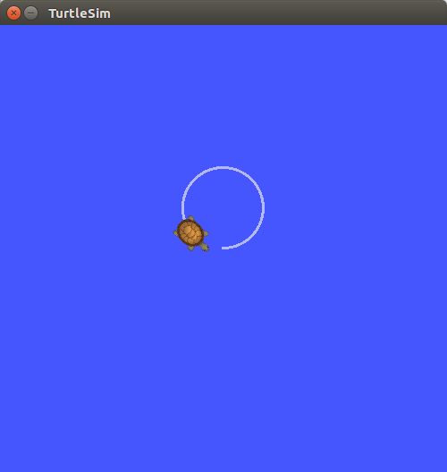

## rospy_tutorial/ Tutorials/ Turtlesim


---

## 간단한 turtlesim의 거북이를 제어하는 패키지 `turtle_pkg` 작성

**출처 :**  <http://wiki.ros.org/rospy_tutorials/Tutorials/WritingPublisherSubscriber>

**튜토리얼 레벨 :**  초급

**선수 학습 :**  ROS 튜토리얼

**빌드 환경 :**  catkin **/** Ubuntu 20.04 **/** Noetic

---

### 1. 패키지 생성

작업경로를 ```~/catkin_ws/src``` 로 변경 후,  ```catkin_create_pkg``` 명령으로  ```rospy``` 에 의존하는`turtle_pkg ` 패키지 생성.

작업경로 변경

```bash
cd ~/catkin_ws/src
```

패키지 생성

```bash
catkin_create_pkg turtle_pkg rospy
```

생성된 ```turtle_pkg``` 패키지 폴더로 경로 변경 후, 폴더 내용 확인.

```bash
$ cd turtle_pkg
$ ls
CMakeLists.txt  package.xml  src
```

`turtlesim`패키지의 `turtle_teleop_key`와 같이 `turtlesim`의 거북이를 제어할 수 있는 노드 `remote_turtle.py`를 작성해보자.

### 2.  `turtlesim`의 거북이를 원운동 시키는 노드`circle_move.py`작성 및 구동


#### 2.1 `circle_move.py`작성

코드 작성을 위해 `~/catkin_ws/src/turtle_pkg/src`로 작업경로를 변경한다.

```bash
cd ~/catkin_ws/src/turtle_pkg/src
```

`touch`명령으로 크기가 0인 파일 `circle_move.py`를 생성한다.

```bash
touch circle_move.py
```

`ls -al`명령으로 된 파일생성을 확인한다.

```bash
ls -al
total 8
drwxrwxr-x 2 gnd0 gnd0 4096  7월 14 09:06 .
drwxrwxr-x 3 gnd0 gnd0 4096  7월 13 16:36 ..
-rw-rw-r-- 1 gnd0 gnd0    0  7월 14 09:06 circle_move.py
```

`touch circle_move.py`명령으로 생성된 `circle_move.py`파일에 실행 속성을 부여한다.

```bash
chmod +x circle_move.py
```

`ls -al`명령으로 된 실행 속성 부여 여부를 확인한다.

```bash
ls -al
total 8
drwxrwxr-x 2 gnd0 gnd0 4096  7월 14 09:06 .
drwxrwxr-x 3 gnd0 gnd0 4096  7월 13 16:36 ..
-rwxrwxr-x 1 gnd0 gnd0    0  7월 14 09:06 circle_move.py
```

`circle_move.py` 파일 편집을 위해 다음 명령을 실행한다.

```bash
gedit circle_move.py &
```


```python
#!/usr/bin/env python3

import rospy,os
from geometry_msgs.msg import Twist

class CircleMove:

    def __init__(self):
        rospy.init_node('circle_move', anonymous=True)
        
def main():
    try:
        node = CircleMove()
        pub = rospy.Publisher('/turtle1/cmd_vel', Twist, queue_size=10)
        tw = Twist()
        tw.linear.x = 1.25; tw.angular.z = 0.5
        rate = rospy.Rate(10) # 10hz
        while not rospy.is_shutdown():
            pub.publish(tw); rate.sleep()
    except (KeyboardInterrupt, rospy.ROSInterruptException):
        pass
    finally:
        print("Program terminated!")

if __name__ == "__main__":
    main()
```


#### 2.2. 작성한 `turtle_pkg` 빌드

`catkin_make` 실행을 위해 작업 경로를 catkin workspace 로 사용하고 있는 `~/catkin_ws` 로 변경한다.

```bash
cd ~/catkin_ws
```

`catkin_make` 실행.

```bash
catkin_make
```

빌드작업으로 변경된  `~/catkin_ws/devel/setup.bash` 의 내용을 `source` 명령을 이용하여 반영시킨다.

```bash
source ./devel/setup.bash
```


#### 3. `circle_move.py`구동

`roscore` 실행

```bash
roscore
```


`turtlesim` 패키지의 `turtlesim_node` 구동

```bash
rosrun turtlesim turtlesim_node
```


`circle_move.py`구동

```
rosrun turtle_pkg circle_move.py
```

`circle_move.py`노드를 구동하면 다음과같이 거북이가 원운동을 수행하는 것을 확인할 수 있다.




`rostopic pub`명령으로 같은 효과를 주려면 다음과 같이 실행한다.

```
rostopic pub -r 10 /turtle1/cmd_vel geometry_msgs/Twist \
'{linear: {x: 1.25, y: 0.0, z: 0.0}, angular: {x: 0.0, y: 0.0, z: 0.5}}'
```


### 2. `turtlesim` 거북이 원격제어노드`remote_turtle.py`작성 및 구동

#### 2.1 키보드 입력 시 `enter`키 입력 없이 바로바로 키보드 입력이 전달되는 키보드 입력사용자 정의 라이브러리 `getchar.py`를 작성

`turtlesim`패키지의 `turtle_teleop_key`노드와 같이 키보드로 거북이를 원격제어하는 `remote_turtle.py`노드를 작성해보자.

파이썬에서 제공하는 키보드 입력을 받기위한 수단은 `input`함수이다. 하지만 `input`함수는 매 키입력마다 `enter`키를 입력해야 키입력이 전달되는 불편함이 있으므로 키 입력 시 `enter`키 입력 없이 바로바로 키입력이 전달되는 키보드 입력사용자 정의 라이브러리 `getchar.py`를 작성하여 `remote_turtle.py`에서 `import`하여 사용하려 한다. 

작업경로를 `~/catkin_ws/src/tirtle_pkg/src`로 변경한다. 

```bash
cd ~/catkin_ws/src/tirtle_pkg/src
```

크기가 0인 `getchar.py`파일 생성

```bash
touch getchar.py
```

`getchar.py`작성

```bash
gedit getchar.py
```

```python
import os, time, sys, termios, atexit, tty
from select import select
  
# class for checking keyboard input
class Getchar:
    def __init__(self):
        # Save the terminal settings
        self.fd = sys.stdin.fileno()
        self.new_term = termios.tcgetattr(self.fd)
        self.old_term = termios.tcgetattr(self.fd)
  
        # New terminal setting unbuffered
        self.new_term[3] = (self.new_term[3] & ~termios.ICANON & ~termios.ECHO)
        termios.tcsetattr(self.fd, termios.TCSAFLUSH, self.new_term)
  
        # Support normal-terminal reset at exit
        atexit.register(self.set_normal_term)
      
      
    def set_normal_term(self):
        termios.tcsetattr(self.fd, termios.TCSAFLUSH, self.old_term)
  
    def getch(self):        # get 1 byte from stdin
        """ Returns a keyboard character after getch() has been called """
        return sys.stdin.read(1)
  
    def chk_stdin(self):    # check keyboard input
        """ Returns True if keyboard character was hit, False otherwise. """
        dr, dw, de = select([sys.stdin], [], [], 0)
        return dr
```

- 클라스`Getchar`의 멤버 함수 중 `chk_stdin()`은 키 입력이 있으면 `True`를, 없으면 `False`를 반환하며, getch()는 입력된 키값을 반환한다.
- `getchar.py`파일은 어딘가에 `import`되어 사용될 목적이고, 단독으로 실행할 목적이 아니므로 `#! /usr/bin/env python3`와 같은 shebang(셔뱅)은 굳이 기입할 필요 없다.


#### 2.2 거북이 원격제어 노드 `remote_turtle.py`작성

`turtlesim_node`가 구동된 상태에서 토픽 리스트를 확인해보면 다음과 같다.

```bash
$ rostopic list 
/rosout
/rosout_agg
/turtle1/cmd_vel
/turtle1/color_sensor
/turtle1/pose
```

이 때 `/turtle1/cmd_vel`토픽의 형식을 알아보기 위해 다음 명령을 실행한다.

```bash
rostopic type /turtle1/cmd_vel
```

```bash
$ rostopic type /turtle1/cmd_vel 
geometry_msgs/Twist
```


앞서 [간단한 토픽 발행 및 구독](./rospy_1_WritingSimplePubSub.md)실습에서 `example_pub.py`노드 실행 후 토픽목록을 확인 결과는 다음과 같다. 

```bash
rostopic list 
/hello
/rosout
/rosout_agg
```

이 때 `/hello`토픽의 형식을 확인해보면 다음과 같다.

```bash
rostopic type /hello 
std_msgs/String
```

`std_msgs/String` 메세지 형식을 `example_pub.py`에서 `import`하는 소스 코드는 다음과 같다.

```python
from std_msgs.msg import String
```

그렇다면 `geometry_msgs/Twist` 메세지 형식을 `import`하는 **Python 코드**는 

```python
from geometry_msgs.msg import Twist
```

와 같이 작성하여야 함을 알 수 있다.  이제 `turtle_pkg`패키지에 `remote_turtle.py`노드를 추가해보자.

`~/catkin_ws/src/turtle_pkg/src`로 작업경로 변경

```bash
cd ~/catkin_ws/src/turtle_pkg/src
```

`ls -al`명령으로 `getchar.py` 존재 확인

```bash
ls -al
total 28
drwxrwxr-x 3 gnd0 gnd0 4096  7월 14 15:52 .
drwxrwxr-x 3 gnd0 gnd0 4096  7월 14 14:40 ..
-rwxrwxr-x 1 gnd0 gnd0  685  7월 14 14:58 circle_move.py
-rw-rw-rw- 1 gnd0 gnd0 1118  7월  2 06:24 getchar.py
```


크기가 0인 `remote_turtle.py` 생성

```bash
touch remote_turtle.py
```


`remote_turtle.py`파일에 실행속성 부여

```bash
chmod +x remote_turtle.py
```


`remote_turtle.py`파일 편집

```bash
gedit remote_turtle.py
```

```python
#!/usr/bin/env python3

import rospy
from getchar import Getchar
from geometry_msgs.msg import Twist

msg = """
==========================
 turtlesim Keyboard Teleop
==========================

w : move forward
s : move backward

a : rotate left
d : rotate right

SPACE : Stop

CTRL+C, q : Quit
==========================
"""

class RemoteTurtle():

    def __init__(self):
        rospy.init_node("remote_turtle")


def main():
    try:
        node = RemoteTurtle()

        pub = rospy.Publisher("/turtle1/cmd_vel", Twist, queue_size=10)
        tw = Twist()
        kb = Getchar()

        print(msg)
        
        stop_time = rospy.Time.now()
        while not rospy.is_shutdown():
            if kb.chk_stdin():
                ch = kb.getch()

                if ch == 'w':
                    tw.linear.x = 2.0;  tw.angular.z = 0.0; print("move forward")
                elif ch == 's':
                    tw.linear.x = -2.0;  tw.angular.z = 0.0; print("move backward")
                elif ch == 'a':
                    tw.linear.x = 0.0;  tw.angular.z = 2.0; print("rotate left")
                elif ch == 'd':
                    tw.linear.x = 0.0;  tw.angular.z = -2.0; print("rotate right")
                elif ch == ' ':
                    tw.linear.x = tw.angular.z = 0.0; print("stop move")
                elif ch == 'q':
                    break
                    
                stop_time = rospy.Time.now() + rospy.Duration(2.0)
                
                if rospy.Time.now() >= stop_time:
                     tw.linear.x = 0.0; tw.angular.z = 0.0
                pub.publish(tw)
        tw.linear.x = 0.0; tw.angular.z = 0.0; pub.publish(tw); print("Program terminated!")

    except (KeyboardInterrupt, rospy.ROSInterruptException):
        pass
    finally:
        tw.linear.x = tw.angular.z = 0.0;   pub.publish(tw)
        print("Program terminated!")

if __name__ == "__main__":
    main()
```


##### `turtle_pkg` 빌드

`catkin_make` 실행을 위해 작업 경로를 catkin workspace 로 사용하고 있는 `~/catkin_ws` 로 변경한다.

```bash
cd ~/catkin_ws
```

`catkin_make` 실행.

```bash
catkin_make
```

빌드작업으로 변경된  `~/catkin_ws/devel/setup.bash` 의 내용을 `source` 명령을 이용하여 반영시킨다.

```bash
source ./devel/setup.bash
```


##### `remote_turtle.py`구동

`roscore` 실행

```bash
roscore
```


`turtlesim` 패키지의 `turtlesim_node` 구동

```bash
rosrun turtlesim turtlesim_node
```


`remote_turtle.py`구동

```
rosrun turtle_pkg remote_turtle.py
```

```
rosrun turtle_pkg remote_turtle.py 

==========================
 turtlesim Keyboard Teleop
==========================

w : move forward
s : move backward

a : rotate left
d : rotate right

SPACE : Stop

CTRL+C, q : Quit
==========================
```

`w`: 전진, `s`: 후진, `a`: 좌회전, `d`: 우회전 ` `: 정지, `q`: 프로그램 종료 와 같이 제어 되는 지 확인한다. 


[튜토리얼 목록](../README.md) 


