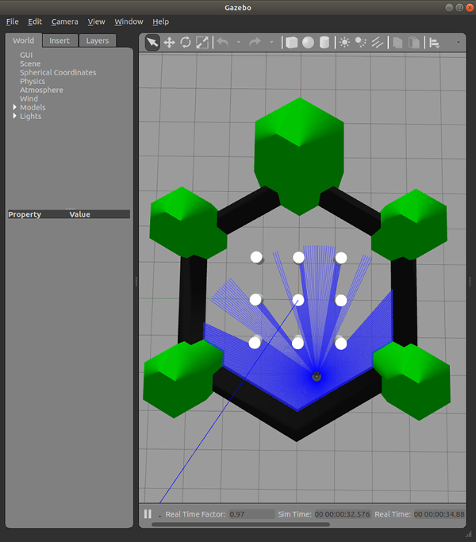
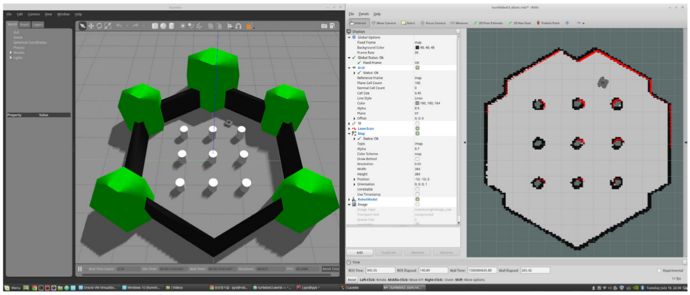
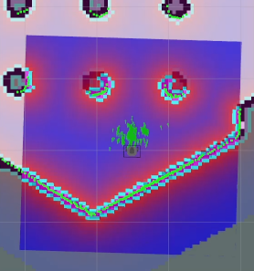
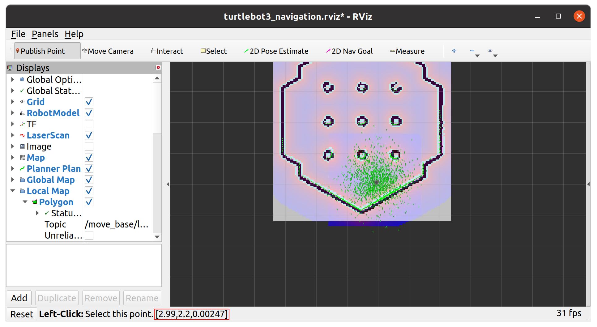

## Turtlebot3 시뮬레이션


---

## Turtlebot3 Gazebo 시뮬레이션

**Turtlebot3 Gazebo** 시뮬레이션을 이용하여 **SLAM** / **Navigation** 실습을 해보자.

**출처 :**  <https://docs.robotis.com/docs/systems/turtlebot3/simulation/gazebo_simulation>

**튜토리얼 레벨 :**  초급

**선수 학습 :**  ROS 튜토리얼

**빌드 환경 :**  catkin **/** Ubuntu 20.04 **/** Noetic

---

#### 1. ROS 의존성 설치

```bash
sudo apt-get install ros-noetic-joy ros-noetic-teleop-twist-joy \
  ros-noetic-teleop-twist-keyboard ros-noetic-laser-proc \
  ros-noetic-rgbd-launch ros-noetic-rosserial-arduino \
  ros-noetic-rosserial-python ros-noetic-rosserial-client \
  ros-noetic-rosserial-msgs ros-noetic-amcl ros-noetic-map-server \
  ros-noetic-move-base ros-noetic-urdf ros-noetic-xacro \
  ros-noetic-compressed-image-transport ros-noetic-rqt* ros-noetic-rviz \
  ros-noetic-gmapping ros-noetic-navigation ros-noetic-interactive-markers
```


#### 2. 터틀봇3 ROS 패키지 설치

```bash
sudo apt install ros-noetic-dynamixel-sdk ros-noetic-turtlebot3-msgs ros-noetic-turtlebot3
```


#### 3. 터틀봇3 ROS 시뮬레이션 패키지 설치

**`~/catkin_ws/src`로 작업경로 변경**

```bash
cd ~/catkin_ws/src
```


**터틀봇3 ROS 시뮬레이션 패키지 소스코드 복제**

```bash
git clone -b noetic https://github.com/ROBOTIS-GIT/turtlebot3_simulations.git
```


**빌드**

```bash
cd ~/catkin_ws && catkin_make
```


**터틀봇3 모델 설정**

터틀봇3는 `burger`, `wapple`, `wapple_pi` 3가지 모델이 있으므로 어떤 모델을 시뮬레이션할 것인가를 정해줘야한다.

```bash
export TURTLEBOT3_MODEL=burger
```

터미널을 열 때 마다 자동으로 적용되도록 `~/.bashrc`에 `export TURTLEBOT3_MODEL=burger`를 추가하자.

```bash
gedit ~/.bashrc
```

`export ROS_HOSTNAME`을 찾아서 그다음 행에 에 `export TURTLEBOT3_MODEL=burger` 추가 후, 저장, 종료한다.

터미널을 새로열면  `export TURTLEBOT3_MODEL=burger`가 자동 반영된다.

현재 이미 열려 있는터미널에 반영하려면 해당 터미널에서`~/.bashrc`를 `source`한다.

```bash
source ~/.bashrc
```


#### 4. `turtlebot3_world` 에서 `Gazebo`시뮬레이션구동

```bash
roslaunch turtlebot3_gazebo turtlebot3_world.launch use_sim_time:=true
```




#### 5.SLAM 노드구동

**5.1 로봇 모델 설정**

```
export TURTLEBOT3_MODEL=burger
```

**5.2 SLAM 구동**

```
 roslaunch turtlebot3_slam turtlebot3_slam.launch slam_methods:=gmapping use_sim_time:=true
```

**5.3 원격 조종 노드 구동**

```
roslaunch turtlebot3_teleop turtlebot3_teleop_key.launch
```

```
oslaunch turtlebot3_teleop turtlebot3_teleop_key.launch

 Control Your TurtleBot3!
 ---------------------------
 Moving around:
        w
   a    s    d
        x

 w/x : increase/decrease linear velocity
 a/d : increase/decrease angular velocity
 space key, s : force stop

 CTRL-C to quit
```




**5.4 작성된 지도 저장**

위 오른쪽 그림과 같이 모든 영역을 탐색하여 밝은 영역으로 만들었다면 현재 상태를 지도로 저장한다.

```
rosrun map_server map_saver -f ~/map
```

지도저장 확인

```
ls -al ~/map.*
-rw-rw-r-- 1 gnd0 gnd0 14275  5월  3  2023 /home/gnd0/map.pgm
-rw-rw-r-- 1 gnd0 gnd0   132  7월 16 16:00 /home/gnd0/map.yaml
```


#### 6. Navigation 구동

**6.1 로봇 모델 설정**

```
export TURTLEBOT3_MODEL=burger
```

**6.2 Navigation 구동**

```
roslaunch turtlebot3_navigation turtlebot3_navigation.launch map_file:=$HOME/map.yaml use_sim_time:=true
```


**6.3 Pose Estimate**

**내비게이션을 실행하기 전에 초기 자세 추정을** 수행해야 합니다. 이 과정은 정확한 내비게이션에 필수적인 AMCL 매개변수를 초기화합니다. TurtleBot3는 LDS 센서 데이터를 사용하여 지도에 정확하게 위치해야 하며, 해당 데이터가 표시된 지도와 정확히 겹쳐야 한다.

1. RViz2 메뉴에서 `2D Pose Estimate`버튼 클릭 .
2. 지도에서 로봇의 실제 위치를 클릭하고 큰 녹색 화살표를 로봇이 바라보는 방향으로 드래그하세요.
3. 저장된 지도에 LDS 센서 데이터가 겹쳐질 때까지 1단계와 2단계를 반복합니다.


**6.4 키보드 원격 조종 노드 실행**

```
roslaunch turtlebot3_teleop turtlebot3_teleop_key.launch
```

로봇을 천천히 움직여 녹색 점들로 표시된 지도상에서의 추정된 로봇의 위치를 일치시킨다.

  

6.5 Navigation 목표 위치 설정

1. RViz2 메뉴에서 `Navigation2 Goal`버튼 클릭.
2. 지도에서 로봇의 목적지를 클릭하고 녹색 화살표를 로봇이 향할 방향으로 드래그.
   - 이 녹색 화살표는 로봇의 목적지를 나타내는 표식입니다.
   - 화살표의 시작점은 목적지의 좌표이고, 각도는 화살표 의 방향에 따라 결정된다.
   - `x`, `y`, `θ` 값이 설정되는 즉시 TurtleBot3는 목적지를 향해 즉시 이동을 시작한다.


네비게이션 `rviz`화면에 `publish point` 버튼이 나타나지 않을 경우 

`~/turtlebot3_navigation.rviz`작성

```
gedit ~/turtlebot3_navigation.rviz
```

```yaml
Panels:
  - Class: rviz/Displays
    Help Height: 78
    Name: Displays
    Property Tree Widget:
      Expanded:
        - /TF1/Frames1
        - /TF1/Tree1
        - /Global Map1/Costmap1
        - /Global Map1/Planner1
        - /Local Map1
        - /Local Map1/Polygon1
        - /Local Map1/Costmap1
        - /Local Map1/Planner1
      Splitter Ratio: 0.5
    Tree Height: 783
  - Class: rviz/Selection
    Name: Selection
  - Class: rviz/Tool Properties
    Expanded:
      - /2D Pose Estimate1
      - /2D Nav Goal1
    Name: Tool Properties
    Splitter Ratio: 0.588679016
  - Class: rviz/Views
    Expanded:
      - /Current View1
    Name: Views
    Splitter Ratio: 0.5
  - Class: rviz/Time
    Experimental: false
    Name: Time
    SyncMode: 0
    SyncSource: LaserScan
Visualization Manager:
  Class: ""
  Displays:
    - Alpha: 0.5
      Cell Size: 1
      Class: rviz/Grid
      Color: 160; 160; 164
      Enabled: true
      Line Style:
        Line Width: 0.0299999993
        Value: Lines
      Name: Grid
      Normal Cell Count: 0
      Offset:
        X: 0
        Y: 0
        Z: 0
      Plane: XY
      Plane Cell Count: 20
      Reference Frame: <Fixed Frame>
      Value: true
    - Alpha: 1
      Class: rviz/RobotModel
      Collision Enabled: false
      Enabled: true
      Links:
        All Links Enabled: true
        Expand Joint Details: false
        Expand Link Details: false
        Expand Tree: false
        Link Tree Style: Links in Alphabetic Order
        base_footprint:
          Alpha: 1
          Show Axes: false
          Show Trail: false
        base_link:
          Alpha: 1
          Show Axes: false
          Show Trail: false
          Value: true
        base_scan:
          Alpha: 1
          Show Axes: false
          Show Trail: false
          Value: true
        caster_back_link:
          Alpha: 1
          Show Axes: false
          Show Trail: false
          Value: true
        imu_link:
          Alpha: 1
          Show Axes: false
          Show Trail: false
        wheel_left_link:
          Alpha: 1
          Show Axes: false
          Show Trail: false
          Value: true
        wheel_right_link:
          Alpha: 1
          Show Axes: false
          Show Trail: false
          Value: true
      Name: RobotModel
      Robot Description: robot_description
      TF Prefix: ""
      Update Interval: 0
      Value: true
      Visual Enabled: true
    - Class: rviz/TF
      Enabled: false
      Frame Timeout: 15
      Frames:
        All Enabled: false
      Marker Scale: 1
      Name: TF
      Show Arrows: true
      Show Axes: true
      Show Names: false
      Tree:
        {}
      Update Interval: 0
      Value: false
    - Alpha: 1
      Autocompute Intensity Bounds: true
      Autocompute Value Bounds:
        Max Value: 10
        Min Value: -10
        Value: true
      Axis: Z
      Channel Name: intensity
      Class: rviz/LaserScan
      Color: 0; 255; 0
      Color Transformer: FlatColor
      Decay Time: 0
      Enabled: true
      Invert Rainbow: false
      Max Color: 255; 255; 255
      Max Intensity: 13069
      Min Color: 0; 0; 0
      Min Intensity: 28
      Name: LaserScan
      Position Transformer: XYZ
      Queue Size: 10
      Selectable: true
      Size (Pixels): 3
      Size (m): 0.0300000012
      Style: Flat Squares
      Topic: /scan
      Unreliable: false
      Use Fixed Frame: true
      Use rainbow: true
      Value: true
    - Class: rviz/Image
      Enabled: false
      Image Topic: /raspicam_node/image
      Max Value: 1
      Median window: 5
      Min Value: 0
      Name: Image
      Normalize Range: true
      Queue Size: 2
      Transport Hint: compressed
      Unreliable: false
      Value: false
    - Alpha: 0.699999988
      Class: rviz/Map
      Color Scheme: map
      Draw Behind: false
      Enabled: true
      Name: Map
      Topic: /map
      Unreliable: false
      Use Timestamp: false
      Value: true
    - Alpha: 1
      Buffer Length: 1
      Class: rviz/Path
      Color: 0; 0; 0
      Enabled: true
      Head Diameter: 0.300000012
      Head Length: 0.200000003
      Length: 0.300000012
      Line Style: Lines
      Line Width: 0.0299999993
      Name: Planner Plan
      Offset:
        X: 0
        Y: 0
        Z: 0
      Pose Color: 255; 85; 255
      Pose Style: None
      Radius: 0.0299999993
      Shaft Diameter: 0.100000001
      Shaft Length: 0.100000001
      Topic: /move_base/NavfnROS/plan
      Unreliable: false
      Value: true
    - Class: rviz/Group
      Displays:
        - Alpha: 0.699999988
          Class: rviz/Map
          Color Scheme: costmap
          Draw Behind: true
          Enabled: true
          Name: Costmap
          Topic: /move_base/global_costmap/costmap
          Unreliable: false
          Use Timestamp: false
          Value: true
        - Alpha: 1
          Buffer Length: 1
          Class: rviz/Path
          Color: 255; 0; 0
          Enabled: true
          Head Diameter: 0.300000012
          Head Length: 0.200000003
          Length: 0.300000012
          Line Style: Lines
          Line Width: 0.0299999993
          Name: Planner
          Offset:
            X: 0
            Y: 0
            Z: 0
          Pose Color: 255; 85; 255
          Pose Style: None
          Radius: 0.0299999993
          Shaft Diameter: 0.100000001
          Shaft Length: 0.100000001
          Topic: /move_base/DWAPlannerROS/global_plan
          Unreliable: false
          Value: true
      Enabled: true
      Name: Global Map
    - Class: rviz/Group
      Displays:
        - Alpha: 1
          Class: rviz/Polygon
          Color: 0; 0; 0
          Enabled: true
          Name: Polygon
          Topic: /move_base/local_costmap/footprint
          Unreliable: false
          Value: true
        - Alpha: 0.699999988
          Class: rviz/Map
          Color Scheme: costmap
          Draw Behind: false
          Enabled: true
          Name: Costmap
          Topic: /move_base/local_costmap/costmap
          Unreliable: false
          Use Timestamp: false
          Value: true
        - Alpha: 1
          Buffer Length: 1
          Class: rviz/Path
          Color: 255; 255; 0
          Enabled: true
          Head Diameter: 0.300000012
          Head Length: 0.200000003
          Length: 0.300000012
          Line Style: Lines
          Line Width: 0.0299999993
          Name: Planner
          Offset:
            X: 0
            Y: 0
            Z: 0
          Pose Color: 255; 85; 255
          Pose Style: None
          Radius: 0.0299999993
          Shaft Diameter: 0.100000001
          Shaft Length: 0.100000001
          Topic: /move_base/DWAPlannerROS/local_plan
          Unreliable: false
          Value: true
      Enabled: true
      Name: Local Map
    - Alpha: 1
      Arrow Length: 0.0500000007
      Axes Length: 0.300000012
      Axes Radius: 0.00999999978
      Class: rviz/PoseArray
      Color: 0; 192; 0
      Enabled: true
      Head Length: 0.0700000003
      Head Radius: 0.0299999993
      Name: Amcl Particles
      Shaft Length: 0.230000004
      Shaft Radius: 0.00999999978
      Shape: Arrow (Flat)
      Topic: /particlecloud
      Unreliable: false
      Value: true
    - Alpha: 1
      Axes Length: 1
      Axes Radius: 0.100000001
      Class: rviz/Pose
      Color: 255; 25; 0
      Enabled: true
      Head Length: 0.300000012
      Head Radius: 0.100000001
      Name: Goal
      Shaft Length: 0.5
      Shaft Radius: 0.0500000007
      Shape: Arrow
      Topic: /move_base_simple/goal
      Unreliable: false
      Value: true
  Enabled: true
  Global Options:
    Background Color: 48; 48; 48
    Default Light: true
    Fixed Frame: map
    Frame Rate: 30
  Name: root
  Tools:
    - Class: rviz/PublishPoint
      Single click: true
      Topic: /clicked_point
    - Class: rviz/MoveCamera
    - Class: rviz/Interact
      Hide Inactive Objects: true
    - Class: rviz/Select
    - Class: rviz/SetInitialPose
      Topic: /initialpose
    - Class: rviz/SetGoal
      Topic: /move_base_simple/goal
    - Class: rviz/Measure
  Value: true
  Views:
    Current:
      Angle: -1.57079637
      Class: rviz/TopDownOrtho
      Enable Stereo Rendering:
        Stereo Eye Separation: 0.0599999987
        Stereo Focal Distance: 1
        Swap Stereo Eyes: false
        Value: false
      Invert Z Axis: false
      Name: Current View
      Near Clip Distance: 0.00999999978
      Scale: 100
      Target Frame: <Fixed Frame>
      Value: TopDownOrtho (rviz)
      X: 0
      Y: 0
    Saved: ~
Window Geometry:
  Displays:
    collapsed: false
  Height: 1027
  Hide Left Dock: false
  Hide Right Dock: true
  Image:
    collapsed: false
  QMainWindow State: 000000ff00000000fd00000004000000000000016a000003a0fc0200000007fb0000001200530065006c0065006300740069006f006e00000001e10000009b0000006600fffffffb0000001e0054006f006f006c002000500072006f007000650072007400690065007302000001ed000001df00000185000000a3fb000000120056006900650077007300200054006f006f02000001df000002110000018500000122fb000000200054006f006f006c002000500072006f0070006500720074006900650073003203000002880000011d000002210000017afb000000100044006900730070006c0061007900730100000043000003a0000000df00fffffffb0000000a0049006d0061006700650000000317000000cc0000001800fffffffb0000000a0049006d0061006700650000000330000000ce0000000000000000000000010000010f000003a0fc0200000003fb0000001e0054006f006f006c002000500072006f00700065007200740069006500730100000041000000780000000000000000fb0000000a005600690065007700730000000043000003a0000000b800fffffffb0000001200530065006c0065006300740069006f006e010000025a000000b200000000000000000000000200000490000000a9fc0100000001fb0000000a00560069006500770073030000004e00000080000002e10000019700000003000004a00000003efc0100000002fb0000000800540069006d00650000000000000004a00000022400fffffffb0000000800540069006d006501000000000000045000000000000000000000038f000003a000000004000000040000000800000008fc0000000100000002000000010000000a0054006f006f006c00730100000000ffffffff0000000000000000
  Selection:
    collapsed: false
  Time:
    collapsed: false
  Tool Properties:
    collapsed: false
  Views:
    collapsed: true
  Width: 1279
  X: 0
  Y: 0
```

`~/turtlebot3_navigation.rviz`저장 후 `/opt/ros/noetic/share/turtlebot3_navigation/rviz`에 복사.

```bash
sudo cp turtlebot3_navigation.rviz /opt/ros/noetic/share/turtlebot3_navigation/rviz/
```

다시 네비게이션을 구동하면 `publish point`버튼이 `rviz`화면에 나타난다.





네비게이션 `action client` 예제 `move_base_client.py`

```python
#!/usr/bin/env python3

import rospy
import actionlib

from move_base_msgs.msg import MoveBaseAction
from move_base_msgs.msg import MoveBaseGoal
from actionlib_msgs.msg import GoalStatus


class MoveBaseClient:

    def __init__(self):
        rospy.init_node("client_move_base", anonymous=False)

        self.client = actionlib.SimpleActionClient(
            "/move_base",
            MoveBaseAction
        )

        rospy.loginfo("Waiting for /move_base action server...")

        if not self.client.wait_for_server(rospy.Duration(30.0)):
            rospy.logerr("/move_base action server is not available.")
            rospy.signal_shutdown("move_base action server not available")
            return

        rospy.loginfo("/move_base action server connected.")

    def send_goal(self, x, y, qz=0.0, qw=1.0):
        goal = MoveBaseGoal()

        goal.target_pose.header.frame_id = "map"
        goal.target_pose.header.stamp = rospy.Time.now()

        goal.target_pose.pose.position.x = x
        goal.target_pose.pose.position.y = y
        goal.target_pose.pose.position.z = 0.0

        goal.target_pose.pose.orientation.x = 0.0
        goal.target_pose.pose.orientation.y = 0.0
        goal.target_pose.pose.orientation.z = qz
        goal.target_pose.pose.orientation.w = qw

        rospy.loginfo(
            "Sending goal: x=%.2f, y=%.2f, qz=%.4f, qw=%.4f"
            % (x, y, qz, qw)
        )

        self.client.send_goal(
            goal,
            done_cb=self.done_callback,
            active_cb=self.active_callback,
            feedback_cb=self.feedback_callback
        )

    def active_callback(self):
        rospy.loginfo("Goal accepted.")

    def feedback_callback(self, feedback):
        x = feedback.base_position.pose.position.x
        y = feedback.base_position.pose.position.y

        rospy.loginfo_throttle(
            1.0,
            "Current position: x=%.2f, y=%.2f" % (x, y)
        )

    def done_callback(self, status, result):
        if status == GoalStatus.SUCCEEDED:
            print("-----------------------------")
            print("arrived at goal position!!!!!")
            print("-----------------------------")

        elif status == GoalStatus.PREEMPTED:
            rospy.logwarn("Goal was canceled.")

        elif status == GoalStatus.ABORTED:
            rospy.logerr("Goal aborted. The robot could not reach the goal.")

        elif status == GoalStatus.REJECTED:
            rospy.logerr("Goal rejected.")

        elif status == GoalStatus.RECALLED:
            rospy.logwarn("Goal recalled.")

        elif status == GoalStatus.LOST:
            rospy.logerr("Goal lost.")

        else:
            rospy.logwarn("Navigation finished with status: %d" % status)

        rospy.signal_shutdown("Navigation finished")


def main():
    try:
        node = MoveBaseClient()

        if rospy.is_shutdown():
            return

        goal_x = 0.0
        goal_y = 0.0

        node.send_goal(
            x=goal_x,
            y=goal_y,
            qz=0.0,
            qw=1.0
        )

        rospy.spin()

    except rospy.ROSInterruptException:
        print("Program terminated!")


if __name__ == "__main__":
    main()
```


[튜토리얼 목록](../README.md) 


